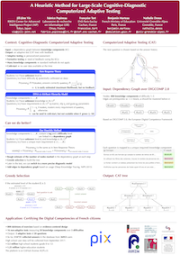

# A Heuristic Method for Large-Scale Cognitive-Diagnostic Computerized Adaptive Testing

[Read the article (PDF)](https://jill-jenn.net/_static/works/a-heuristic-method-for-large-scale-cognitive-diagnostic-computerized-adaptive-testing.pdf).

See our poster:

You can cite it using the following APA and BibTeX entries:

> Vie, J. J., Popineau, F., Tort, F., Marteau, B., & Denos, N. (2017, April). **A Heuristic Method for Large-Scale Cognitive-Diagnostic Computerized Adaptive Testing.** In *Proceedings of the Fourth (2017) ACM Conference on Learning@Scale* (pp. 323-326). ACM.

    @inproceedings{Vie2017PIX,
        Author = {Vie, Jill-J{\^e}nn and Popineau, Fabrice and Tort, Fran{\c{c}}oise and Marteau, Benjamin and Denos, Nathalie},
        Booktitle = {Proceedings of the Fourth (2017) ACM Conference on Learning @ Scale},
        Organization = {ACM},
        Pages = {323--326},
        Title = {A Heuristic Method for Large-Scale Cognitive-Diagnostic Computerized Adaptive Testing},
        Url = {https://github.com/jilljenn/las2017-wip/},
        Year = {2017}}
